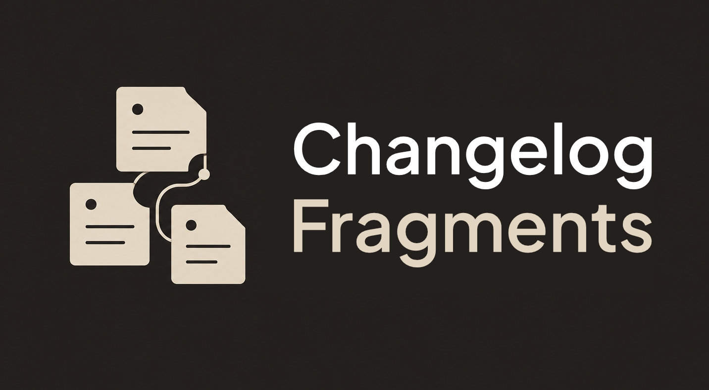

<h1 align="center">
  
</h1>

<p align="center">
  <a href="https://github.com/soledesigngroup/changelog-fragments/actions/workflows/test.yml"></a>
  <a href="package.json">= 18"></a>
  <a href="package.json"></a>
  <a href="LICENSE"></a>
</p>

A collision-free changelog workflow for repos where **several coding agents work at once**, plus the
tooling to keep the changelog from growing without bound.

Two scripts, two slash commands, zero dependencies.

## The problem

A single `docs/changelog.md` is a filesystem race when more than one agent is running. Two sessions
both read the file, both prepend their entry, and the second write silently drops the first. It
happens quietly and you find out later.

## The fix

Nobody edits `changelog.md`. Each session writes its own uniquely-named **fragment**:

```
docs/changelog.d/2026-07-26-webhook-signature-a3f9.md
```

No two agents ever touch the same path, so the collision is structurally impossible. A separate,
serialized **fold** step batches every pending fragment into `changelog.md` and deletes them. This is
the [Changesets](https://github.com/changesets/changesets) / [Towncrier](https://towncrier.readthedocs.io/)
pattern, adapted for agent-written history.

A second step, **condense**, ages entries down through four tiers (full detail → per-day summary →
week-range → archive-only) so `changelog.md` stays a fixed rolling window instead of an ever-growing
file that every session pays to read. Summarization never destroys the original text: the moment a
day leaves the full-detail window, its block moves into `docs/changelog-archive.md` **byte-for-byte**,
so old history stays greppable at original fidelity.

## What it looks like

An agent finishing a session writes `docs/changelog.d/2026-07-26-webhook-signature-a3f9.md` — no date
header, the fold reads the date off the filename:

```markdown
### Security
- **Webhook accepted unsigned events** — an absent signature header short-circuited
  verification. The secret is now constant-time-compared. [`route.ts`](../src/app/api/webhook/route.ts).
```

The fold moves those bullet lines into `docs/changelog.md` **byte-for-byte**, merging same-day
fragments under one heading in canonical category order, and deletes the fragments:

```markdown
## 2026-07-26

### Fixed
- **Wide dialogs clamped to 640px** — a `sm:`-prefixed base width beat callers' overrides.

### Security
- **Webhook accepted unsigned events** — an absent signature header short-circuited
  verification. The secret is now constant-time-compared. [`route.ts`](../src/app/api/webhook/route.ts).

---
```

## Install

```bash
npx degit soledesigngroup/changelog-fragments changelog-fragments
node changelog-fragments/install.mjs /path/to/your-repo
```

Or clone it, if you'd rather keep the history around to pull updates from:

```bash
git clone https://github.com/soledesigngroup/changelog-fragments.git
node changelog-fragments/install.mjs /path/to/your-repo
```

`install.mjs` is idempotent, so re-running it against a repo just updates the scripts and commands in
place — `git pull` first if you cloned.

Flags: `--dry-run` (report only), `--name "Project Name"` (used in the seeded header),
`--no-commands` (leave `.claude/commands/` alone).

**Requirements:** Node 18+. Nothing is installed into the target repo — the two scripts are plain
`.mjs` on node builtins only, so they run in a TypeScript repo, a Python repo, or a repo with no
`package.json` at all. Developed and CI-tested on macOS and Linux; the scripts themselves are
platform-agnostic, but the documented workflows assume a POSIX shell (`$(date +%F)`, `/tmp`,
`openssl rand`), so on Windows use WSL or Git Bash.

## What lands in the target repo

| Path | Purpose |
|------|---------|
| `docs/changelog.d/` + `README.md` | where fragments are written |
| `scripts/collect-changelog.mjs` | the fold — the only writer of `changelog.md`'s Tier-1 zone |
| `scripts/condense-changelog.mjs` | the splice-and-verify helper behind `/changelog-condense` |
| `.claude/commands/changelog-update.md` | `/changelog-update` — writes a fragment |
| `.claude/commands/changelog-condense.md` | `/changelog-condense` — folds, then ages entries down |
| `docs/changelog.md`, `docs/changelog-archive.md` | seeded if absent, **migrated in place** if present |
| `package.json` | gains a `changelog:fold` script (only if a `package.json` exists) |

The installer prints a `CLAUDE.md` snippet to paste — it deliberately doesn't auto-append, because
every `CLAUDE.md` is laid out differently.

## Daily workflow

```bash
# during a session — one fragment per session, stage only your own file
/changelog-update

# when the tree is quiet — serialized, single owner
npm run changelog:fold -- --dry-run
npm run changelog:fold

# any time, writes nothing — pending fragments foldable? changelog structure intact?
npm run changelog:fold -- --check

# periodically — folds first, then ages older entries down the tiers
/changelog-condense

# occasionally — is the system actually being used? (read-only, never a gate)
npm run changelog:fold -- --report
```

Only one fold can run at a time: it takes an exclusive lock and a second invocation exits rather than
racing, so "run it when the tree is quiet" is enforced rather than merely advised.

## Is it working? (`--report`)

Every failure this system has is loud except one. An unfoldable fragment exits non-zero and stays on
disk; a hand-edited changelog fails `--check`; a fold that dies mid-run is recovered by the next one.
But a session that simply **never wrote a fragment** raises no error and leaves no trace — the failure
is the *absence* of an event, so no amount of logging inside these scripts would ever record it.

The only thing that can see it is a ratio against activity, which is what `--report` prints:

```
Capture coverage (git, since 30.days)
  active days             14  22 commit(s) outside the changelog's own files
  documented              11
  undocumented             3  2026-07-29, 2026-07-24, 2026-07-21
  folds                    6  last 2026-08-01
  last condense                2026-07-26
```

A day is *active* if something other than the changelog's own files changed that day, and *documented*
if any tier covers it — a pending fragment, a Tier-1 day block, a summary entry, an archived day, or a
week-range containing the date. Above that section it censuses the pending fragments (by category, with
their lint warnings) and every tier's size, so one command answers both "is anything stuck?" and "is
anyone using this?".

It reads git only for the activity side and degrades to the census alone in a tree git can't read.
`--since <git-date>` moves the window; `--json` emits the same numbers as an object, which is the form
to trend in CI. It writes nothing and always exits 0 — printing a problem is the job, not a verdict.
`--check` remains the gate.

## Searching history

Recent history is `docs/changelog.md` **plus any fragments not yet folded**; everything older lives
verbatim in `docs/changelog-archive.md` (and, once years are shed, `docs/changelog-archive-<YYYY>.md`).
One grep covers every entry ever written, at full original detail:

```bash
grep -rn "<term>" docs/changelog.md docs/changelog.d/ docs/changelog-archive*.md
```

Summaries in `changelog.md` carry each entry's bold subject, anchor-file links, and issue/PR refs
through every tier, so even the condensed view stays greppable by the things you actually search
for — a filename, a feature name, a `#123`.

## Adopting a repo that already has a changelog

`install.mjs` migrates an existing `docs/changelog.md` into the layout the tooling needs. The
migration is **purely additive** — it inserts a header rule, a `---` between day blocks, the
`## Earlier Changes (Summary)` sentinel, and the archive footer, and it **rewrites no entry text**.

The header rule goes above the **first heading of any shape**, not above the first heading the
migrator can read as a day. That matters because the first `---` in the file is what marks the top of
the Tier-1 zone: a Keep a Changelog file (`## [Unreleased]`, `## [1.2.0] - 2026-03-29`) has no
`## YYYY-MM-DD` heading at all, and anchoring the rule to the day zone would drop it at the end of the
file and fold every new entry in *underneath* the whole history.

Legacy day headings are preserved byte-for-byte, including parentheticals
(`## 2026-07-03 (some parenthetical)`) and repeated dates. The fold and the condense planner both read
the leading ISO date off such a heading and ignore the trailing text, so a legacy day still sorts
correctly and still ages out — it comes back as a canonical `### 2026-07-03` summary the first time
condensing reaches it. Only shapes with no ISO date at all (`## [1.2.0]`) stay opaque to the tooling;
they sink down the Tier-1 zone as newer days land above them. Normalizing any of it would mean merging
same-date sections — editing history — which this deliberately doesn't do.

Every migration is verified lossless before anything is written: each non-blank line of the original
must appear in the output, in order, or the install aborts having written nothing. (`---` is exempt on
both sides — it carries no content, and the migrator both inserts rules and re-emits them between day
blocks.) Re-running the installer never re-migrates a file that's already in the expected layout.

## Design notes

**The fold is byte-preserving.** Bullet lines are copied verbatim, never reformatted. That makes the
fold a pure *move*: a folded entry reads exactly as authored, and `git log -S "<bullet text>"` still
finds the feature commit that introduced it rather than the mechanical fold commit.

**The fold never silently drops an entry.** A fragment containing anything the fold can't place — a
heading outside the six canonical categories, text above the first `### Category` — is reported and
**left on disk** rather than partly folded and deleted. Days are inserted in date order, so a fragment
folded late (a session that crossed midnight, a branch merged after a fold) still lands below newer
entries instead of on top of them.

**The archive holds full detail, verbatim.** The moment a day ages out of the 0–3 day window, the
condense helper moves its full-detail block into `docs/changelog-archive.md` byte-for-byte — the
model writes the summary that stays in `changelog.md`, but it never re-types (or gets to paraphrase
away) the detail. Summaries are an index over the archive, not a replacement for it, so a grep over
`docs/` finds every entry ever folded, exactly as authored, no git archaeology required.

**The condense helper does the mechanics, the model does the judgment.** The model writes the summary
prose to temp files; the script performs the splice and runs eleven structural checks (anchors
unambiguous and ordered, no duplicate headings, nothing collapsed without being archived, the 0–3 day
window untouched, no per-day heading covered by a week-range, separator and footer preserved, Tier-4
drops only fully-archived week-ranges, a year shed that conserves every heading and line, a verbatim
auto-archive that conserves every line, and legacy no-date blocks — a migrated Keep a Changelog
history — surviving any splice). **It writes nothing unless every check passes.**

**The model isn't asked to do date arithmetic.** `--plan --today <DATE>` classifies every heading into
its tier and prints the exact anchors and cutoffs to pass — including whether the archive is due to
shed a year. Working "today minus 42 days" out by hand was the least reliable input to the most
destructive operation.

**Dates are compared as ISO strings.** `YYYY-MM-DD` sorts lexicographically, so there is no timezone
handling anywhere and no way for a local-midnight bug to move an entry to the wrong day. The single
exception is `--plan`'s cutoff arithmetic, which is UTC-only and works from the `--today` you pass
rather than the clock.

## Updating an installed repo

Re-run `install.mjs` against it. Scripts, commands, and the fragment README are overwritten; your
changelog files are never touched once migrated. `--dry-run` first if you want to see the diff
surface, and `--no-commands` if that repo has customized the slash commands.

## Tests

```bash
npm test
```

Installs into throwaway repos and exercises the real scripts: messy-changelog migration, the
losslessness guarantee, fold ordering and same-date merging, byte-verbatim bullets, malformed and
unplaceable fragments, fold locking, a repo path containing a space, `--check`, `--plan`, the archive
year shed, a failing-path test for every condense check, the no-`package.json` fallback, and install
idempotency.

`npm test -- <substring>` runs only the matching groups; each group builds its own temp repos.

## What's intentionally not here

The system this was extracted from also synced folded bullets into a Postgres table with commit
attribution, to power an in-app "What's New" page. That half is application-specific and stays out —
the byte-verbatim fold is what makes it reconstructable later via `git log -S` if a repo ever wants it.

## Contributing

Issues and PRs welcome — see [CONTRIBUTING.md](CONTRIBUTING.md). The short version: everything under
`template/` ships verbatim into other people's repos, and [CLAUDE.md](CLAUDE.md) lists the invariants
that are load-bearing, so read that before changing behavior.

Releases are tagged and noted in [CHANGELOG.md](CHANGELOG.md); each entry says whether re-running
`install.mjs` over an existing installation is safe. Pin a version with
`npx degit soledesigngroup/changelog-fragments#v1.2.0`.

## License

[MIT](LICENSE) © Sole Design Group
